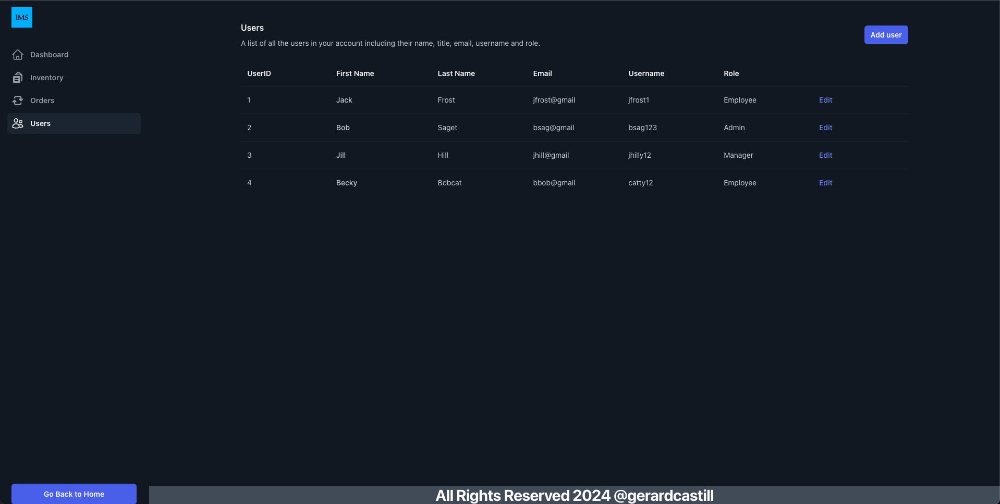

# InventoryPage Management System

## Table of Contents
- [Introduction](#introduction)
  - [Features](#features)
  - [Architecture](#architecture)
  - [Technologies Used](#technologies-used)
- [Demo On AWS](#demo-on-aws)
- [Geting Started](#getting-started)
- [Screenshots](#screenshots)

## Introduction

The Inventory Management System is a comprehensive solution designed to efficiently manage inventory, orders, and employee information in a business environment. Built on a microservice architecture, this system offers modularity, scalability, and flexibility to adapt to the evolving needs of your organization.

### Features

- **Inventory Management:** Keep track of your product inventory including pending stock levels, available stock levels, and product details.
- **Order Management:** Manage orders from creation to fulfillment, track order status, and handle order processing efficiently.
- **Employee Management:** Maintain employee records, assign roles, and assign users to select clients.

### Architecture

The system is built on a microservice architecture, consisting of the following services:

- **Inventory Service:** Responsible for managing inventory-related operations such as adding new products, updating stock levels, and retrieving product information.
- **Order Service:** Handles order processing, including order creation, status updates, and order fulfillment.
- **Employee Service:** Manages employee records, and assigns to orders with select clients.

### Technologies Used

- **Backend:** Java Spring Boot for building microservices, with Spring Data for database interaction.
- **Database:** PostgreSQL for storing inventory, order, and employee data.
- **Frontend:** Create-React-App using Javascript for services and tailwindCSS for styling.

## Demo On AWS

An instance of the app is running on AWS if you do not wish to clone the repo and set up containers locally. Click the link 'Demo on AWS' to give it a go.

[Demo On AWS](URL)


## Getting Started

Before following the steps below make sure to have Docker or Docker Desktop installed to create your own docker images of the application to run locally

1. Clone the repo in a local folder that is accessible through a terminal
2. Open a terminal and go to the project directory to compose the docker containers for the frontend, backend, and database using this command:
   ```
   docker-compose up --build
3. Open a browser to 'localhost:3000' and the app should be running

## Screenshots
Home Page


About Page


Inventory Page


User Page


Order Page


Order Form

